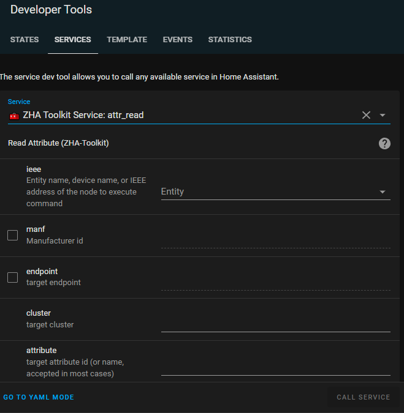

[](https://github.com/hacs/integration)


[](https://github.com/pre-commit/pre-commit)

[ZHA Toolkit](https://github.com/mdeweerd/zha-toolkit) (Zigbee Home
Assistant Toolkit) is a custom service for "rare" Zigbee operations using
the
[ZHA integration component](https://www.home-assistant.io/integrations/zha)
in [Home Assistant](https://www.home-assistant.io/) (an open source home
automation software).

You can add ZHA Toolkit as custom service to Home Assistant using
[HACS (Home Assistant Community Store)](https://hacs.xyz/). ZHA Toolkit is
already available HACS default repository list.

## Purpose

The purpose of ZHA Toolkit and its Home Assistant 'Services' feature, is to
provide direct control overi low level zigbee commands provided in ZHA or
Zigpy that are not otherwise available or too limited for some use cases.

ZHA Toolkit can also:

- Serve as a framework to do local low level coding (the modules are
  reloaded on each call).

- Provide access to some higher level commands such as ZNP backup (and
  restore).

- Make it easier to perform one-time operations where (some) Zigbee
  knowledge is sufficient and avoiding the need to understand the inner
  workings of ZHA or Zigpy (methods, quirks, etc).

### Highlights

- Read Zigbee attributes into Home Assistant attributes
- Daily ZNP Coordinator backup (See blueprint)
- "Low level" access to most Zigbee commands
  (read/write/(un)bind/report/cmd/discover)

# Table of Contents

<!-- mdformat-toc start --slug=github --no-anchors --maxlevel=4 --minlevel=1 -->

- [Purpose](#purpose)
  - [Highlights](#highlights)
- [Table of Contents](#table-of-contents)
- [Setup](#setup)
- [Automations](#automations)
- [Using `zha_toolkit`](#using-zha_toolkit)
- [General recommendations](#general-recommendations)
- [Common options](#common-options)
  - [`ieee`: A reference to the device](#ieee-a-reference-to-the-device)
  - [Events](#events)
  - [Raise an exception on failure](#raise-an-exception-on-failure)
  - [Tries](#tries)
- [Service commands](#service-commands)
  - [`attr_read`: Read an attribute value](#attr_read-read-an-attribute-value)
  - [`attr_write`: Write(/Read) an attribute value](#attr_write-writeread-an-attribute-value)
  - [Binding related](#binding-related)
    - [`bind_ieee`: Bind matching cluster to another device](#bind_ieee-bind-matching-cluster-to-another-device)
    - [`binds_get`: Get binding table from the device](#binds_get-get-binding-table-from-the-device)
    - [`binds_remove_all`: Remove all device to device bindings](#binds_remove_all-remove-all-device-to-device-bindings)
    - [`unbind_coordinator`: Remove all bindings to the coordinator](#unbind_coordinator-remove-all-bindings-to-the-coordinator)
  - [`conf_report`: Configure reporting](#conf_report-configure-reporting)
  - [`conf_report_read`: Read configured reporting](#conf_report_read-read-configured-reporting)
  - [`scan_device`: Scan a device/Read all attribute values](#scan_device-scan-a-deviceread-all-attribute-values)
  - [`zdo_scan_now`: Do a topology scan](#zdo_scan_now-do-a-topology-scan)
  - [Join & Network presence related](#join--network-presence-related)
    - [`handle_join`: Handle join - rediscover device](#handle_join-handle-join---rediscover-device)
    - [`misc_reinitialize`: Reinitialize device](#misc_reinitialize-reinitialize-device)
    - [`leave`](#leave)
    - [`rejoin`](#rejoin)
    - [`zdo_join_with_code`](#zdo_join_with_code)
  - [`zcl_cmd`: Send a Cluster command](#zcl_cmd-send-a-cluster-command)
    - [`zcl_cmd` Example: Send `on` command to an OnOff Cluster.](#zcl_cmd-example-send-on-command-to-an-onoff-cluster)
    - [`zcl_cmd` Example: Send `off` command to an OnOff Cluster:](#zcl_cmd-example-send-off-command-to-an-onoff-cluster)
    - [`zcl_cmd` Example: "Store Scene"](#zcl_cmd-example-store-scene)
    - [`zcl_cmd` Example: "Recall Scene"](#zcl_cmd-example-recall-scene)
    - [`zcl_cmd` Example: "Add Scene"](#zcl_cmd-example-add-scene)
  - [Group related services](#group-related-services)
    - [`add_group`](#add_group)
    - [`get_groups`](#get_groups)
    - [`remove_group`](#remove_group)
    - [`remove_all_groups`](#remove_all_groups)
    - [`add_to_group`](#add_to_group)
    - [`remove_from_group`](#remove_from_group)
    - [`get_zll_groups`](#get_zll_groups)
  - [EZSP/Bellows](#ezspbellows)
    - [`ezsp_backup`: Backup ezsp/bellows network data](#ezsp_backup-backup-ezspbellows-network-data)
  - [ZNP related (TI Zigbee Radio)](#znp-related-ti-zigbee-radio)
    - [`znp_nvram_backup`: Backup ZNP NVRAM data](#znp_nvram_backup-backup-znp-nvram-data)
    - [`znp_nvram_restore`: Restore ZNP NVRAM data](#znp_nvram_restore-restore-znp-nvram-data)
    - [`znp_nvram_reset`: Reset ZNP NVRAM data](#znp_nvram_reset-reset-znp-nvram-data)
    - [`znp_backup`: Backup ZNP network data](#znp_backup-backup-znp-network-data)
    - [`znp_restore`: Restore ZNP network data](#znp_restore-restore-znp-network-data)
  - [Miscellaneous](#miscellaneous)
    - [`backup`: Backup the coordinator](#backup-backup-the-coordinator)
    - [`ota_notify`](#ota_notify)
    - [`zha_devices`: Device List Information to Event or CSV](#zha_devices-device-list-information-to-event-or-csv)
    - [`register_services`: Reregister ZHA-Toolkit services](#register_services-reregister-zha-toolkit-services)
    - [User method](#user-method)
  - [Manufacturers](#manufacturers)
    - [Tuya](#tuya)
      - [`tuya_magic` - Tuya Magic spell](#tuya_magic---tuya-magic-spell)
- [Credits/Motivation](#creditsmotivation)
- [License](#license)
- [Contributing](#contributing)

<!-- mdformat-toc end -->

# Setup

The component files needs to be added to your `custom_components` directory
either manually or using [HACS](https://hacs.xyz/docs/setup/prerequisites)
([Tutorial](https://codingcyclist.medium.com/how-to-install-any-custom-component-from-github-in-less-than-5-minutes-ad84e6dc56ff)).
If you already have HACS, simply look for "ZHA Toolkit" under Integrations
to add it (you still need to do the next step).


Then, the integration is only available in Home Assistant after adding the
next line to `configuration.yaml`, and restarting Home Assistant.

```yaml
zha_toolkit:
```

Before restarting, you may also want to enable debug verbosity.
`zha_toolkit` isn't verbose when you use it occasionnaly. As it's a
service, there is no really good way to inform the user about errors other
than the log.

Logging will help verify that the commands you send have the desired
effect.

Add/update the logger configuration (in the `configuration.yaml` file):

```yaml
logger:
  # The next line sets the default logging level, for all python modules.
  # It seems "recommended" to set it to avoid too much logging.
  default: warning
  logs:
    custom_components.zha_toolkit: debug
```

You can also change the log configuration dynamically by calling the
`logger.setlevel` service. Example that sets the debug level for this
`zha_toolkit` component and for zigpy.zcl\` (which helps to see some
information about actual ZCL frames sent). This method allows you to enable
debug logging only for a limited duration :

```yaml
service: logger.set_level
data:
  custom_components.zha_toolkit: debug
  zigpy.zcl: debug
```

For sleepy devices (on a battery) you may need to wake them up just after
sending the command so that they can receive it.

# Automations

This is a list (of 1) automation:

- DAILY BACKUP OF ZNP DONGLE:
  [](https://my.home-assistant.io/redirect/blueprint_import/?blueprint_url=https%3A%2F%2Fraw.githubusercontent.com%2Fmdeweerd%2Fzha-toolkit%2Fdev%2Fblueprints%2Fbackup_znp.yaml)
- :warning: Under test DAILY BACKUP OF ZNP/EZSP(Bellows) DONGLE TYPE :
  [](https://my.home-assistant.io/redirect/blueprint_import/?blueprint_url=https%3A%2F%2Fraw.githubusercontent.com%2Fmdeweerd%2Fzha-toolkit%2Fdev%2Fblueprints%2Fbackup.yaml)

# Using `zha_toolkit`

This component provides a single service (`zha_toolkit.execute`) that
provides several commands (`command` parameter) providing access to
ZHA/Zigbee actions that are not otherwise available.

You can use a service as an action in automations. So you can send the
commands according to a schedule or other triggers. For instance, you could
plan a daily backup of your TI-ZNP USB Key configuration.

It will be more common to send a Zigbee command only once: for instance
bind one device to another, set a manufacturer attribute, ... .\
You can
perform them using the developer tools.\
The developer tools are handy to
test the service first before adding them to an automation.

Go to Developer Tools > Services in your instance :
[](https://my.home-assistant.io/redirect/developer_services/).

Choose `zha_toolkit.execute` as the service.\
Most parameters can be set
using the UI, there are some cases where you may want to enable Yaml entry
\- you'll have some more flexibility and all parameters fit in your browser
view. On the other hand, the UI interface makes it easier to select the
entity. You can switch back and forth!

There are several examples below for different commands. You can copy/paste
them to start from.

Not all available commands are documented. The undocumented ones were in
the original repository.\
Some of these undocumented commands seem to be
very specific trials from the original authors.\
Feel free to propose
documentation updates.

# General recommendations

- Set the log level to debug ([See Setup](#setup))
- Use [`scan_device`](#scan_device-scan-a-deviceread-all-attribute-values)
  to find out more about your device.
- Use events to see what happens.
- Use `home_assistant.log` to see what happened.
- Check this README.
- Check the
  [Github issues](https://github.com/mdeweerd/zha-toolkit/issues?q=is%3Aissue)
- Check the
  [Home Assistant Forum](https://community.home-assistant.io/search?q=zha_toolkit)
- Check the [examples directory](examples)
- Check
  [zhaquirks](https://github.com/zigpy/zha-device-handlers/tree/dev/zhaquirks)
  for hints about available attributes (available ones, meaning of their
  values)

# Common options

## `ieee`: A reference to the device

In almost all commands you need to provide a reference to the device that
you want to control.

```
  # Valid possibilities for the `ieee` address
  # The full IEEE address:
  ieee: 00:12:4b:00:24:42:d1:dc
  # The short network address
  ieee: 0x2F3E
  # entity name (one of them)
  ieee: light.tz3000_odygigth_ts0505a_12c90efe_level_light_color_on_off
```

The `ieee` address can be the IEEE address, the short network address
(0x1203 for instance), or the entity name (example:
`light.tz3000_odygigth_ts0505a_12c90efe_level_light_color_on_off`). Be
aware that the network address can change over time but it is shorter to
enter if you know it.

The same also applies to the `command_data` field when it is used to
designate a device.

## Events

All commands support setting event names. When set, These events are
generated at the end of the command execution.

```yaml
zha_toolkit.SERVICE_NAME:
  # You can set the next events to use as a trigger.
  # The event data has the result of the command
  event_success: my_read_success_trigger_event
  event_fail: my_read_fail_trigger_event
  event_done: my_read_done_trigger_event
```

It's recommended to use the `event_done` event during interactive use. You
can use `Developer Tools > Events > Listen to events` to see the result of
the service call. You need to use `Listen to events` in a separate
navigator tab, `START LISTENING` and leave it open to see the data of the
events.

By listening for the event, you can see the list of groups that is found
when using `zha_toolkit.get_groups` for instance.\
Otherwise you need to
set the debug level and watch the `home-assistant.log`. That can be useful
if you do a lot of service calls in sequence and you want to look back what
happened.

You can also simply always enable debugging for `zha_toolkit` if you use it
sporadically - it is quite verbose and tends to fill up the logs if you use
it often.

## Raise an exception on failure

```yaml
zha_toolkit.SERVICE_CALL:
  fail_exception: true
```

By default the result of a zigbee transaction is "ignored" for the end
result of the service call: it will appear as if it succeeds (unless you
have the parameters wrong).

So if you want the `Developer Tools > Services > CALL SERVICE` button to
turn red in case the zigbee transaction result is not `SUCCESS`, then add
`fail_exception: true` to the options

## Tries

```yaml
zha_toolkit.SERVICE_CALL:
  tries: 10
```

Tries indicates how many times a zigbee transaction is repeated until it
succeeds. An individual zigbee transaction may fail because of radio
interference or because the device is sleeping.

So by setting `tries: 100` you'll request that zigbee requests are repeated
up too 100 times.

This is not applied everywhere, but it's applied for attribute reading,
writing and report configuration. It's handy when you want to change the
report configuration of your battery powered thermometer for instance.

You may still need to wake them up just after sending the command so that
they can receive it.

# Service commands

Services are easy to called once or tested through Developer Tools >
Services . And you can also use them in scripts, automations, etc. .

Quite a few services can be configured from the UI. And you can also start
using the UI (to select the ieee/entity for instance), and then Go To YAML
mode to add the other parameters.

Empty UI example: 

An example of event data is shown below. The `data>errors` field can be
useful to understand what went wrong. The `ieee_org` fields take the
original value of the "ieee" parameter, and the `ieee` field is the actual
IEEE address found.

```json
{
  "event_type": "my_write_done_trigger_event",
  "data": {
    "ieee_org": "sensor.test_smartenergy_metering",
    "ieee": "00:12:4b:00:24:42:d1:dc",
    "command": "attr_write",
    "start_time": "2022-01-17T21:51:50.416725+00:00",
    "errors": [],
    "params": {
      "cmd_id": null,
      "endpoint_id": 1,
      "cluster_id": 0,
      "attr_id": 16,
      "attr_type": 66,
      "attr_val": "BureauTest",
      "min_interval": 60,
      "max_interval": 300,
      "reportable_change": 1,
      "dir": null,
      "manf": null,
      "tries": 1,
      "expect_reply": true,
      "args": [],
      "state_id": "sensor.test",
      "state_attr": null,
      "allow_create": true,
      "event_success": "my_write_success_trigger_event",
      "event_fail": "my_write_fail_trigger_event",
      "event_done": "my_write_done_trigger_event",
      "read_before_write": true,
      "read_after_write": true,
      "write_if_equal": false
    },
    "str": "BureauTest",
    "read_before": [
      {
        "16": "Bureau"
      },
      {}
    ],
    "result_write": [
      [
        {
          "status": 0,
          "attrid": null
        }
      ]
    ],
    "result_read": [
      {
        "16": "BureauTest"
      },
      {}
    ],
    "success": true
  },
  "origin": "LOCAL",
  "time_fired": "2022-01-17T21:52:02.066310+00:00",
  "context": {
    "id": "c5d4d0d14f7801fda3b9ad471dcbd83b",
    "parent_id": null,
    "user_id": null
  }
}
```

Services that are not documented below yet (not including undocumented ezsp
commands):

- `all_routes_and_neighbours`
- `bind_group`
- `get_routes_and_neighbours`
- `ieee_ping`
- `unbind_group`
- `zdo_flood_parent_annce`
- `zdo_update_nwk_id`

## `attr_read`: Read an attribute value

Read a zigbee attribute value, optionnally write to a state.

```yaml
service: zha_toolkit.attr_read
data:
  ieee: sensor.zigbee_sensor
  # The endpoint is optional - when missing tries to find endpoint matching the cluster
  # endpoint: 1
  cluster: 0xb04
  attribute: 0x50f
  # Optional, state to write the read value to
  state_id: sensor.test
  # Optional, state attribute to write the value to, when missing: writes state itself
  state_attr: option
  # Optional, when true, allows creating the state (if not the state must exist)
  allow_create: true
  # The manufacturer should be set only for manufacturer attributes
  manf: 0x1212
  # Write read value to CSV file
  # Can be useful in automation/script
  # Format: <timestamp>,<name|attr_id>,<value>,<attr_id>,<cluster_id>,<ep_id>,<ieee>,<manf_id>
  # Optional: CSV file to write attribute to - located in /config/csv/...
  csvout: testcsv.csv
  # optional: csvlabel (default label = name from zigpy or attribute id)
  csvlabel: MyAttributeLabel
```

Example: read with write to CSV file

```yaml
service: zha_toolkit.execute
data:
  command: attr_read
  ieee: light.texasinstruments_ti_samplelight_d77add01_level_light_color_on_off
  event_done: zha_done
  attribute: 0
  cluster: 0
  csvout: testcsv.csv
```

Example of CSV output in /config/csv/testcsv.csv (header may be added in
the future)

```csv
2022-02-01T00:10:50.202707+00:00,zcl_version,1,0x0000,0x0000,11,00:12:4b:00:01:dd:7a:d7,
```

## `attr_write`: Write(/Read) an attribute value

Write an attribute value to any endpoint/cluster/attribute.

You can provide the numerical value of the attribute id, or the internal
zigpy name (string).

Before and after writing, the value is read from the attribute. If debug
logging is active, this will be visible in the `home_assistant.log`. The
last read this can be written to a state.

```yaml
service: zha_toolkit.execute
data:
  command: attr_write
  ieee: 5c:02:72:ff:fe:92:c2:5d
  # The endpoint is optional - when missing tries to find endpoint matching the cluster
  endpoint: 11
  cluster: 0x1706
  attribute: 0x0000
  attr_type: 0x41
  # Example of octet strings (the length is added because of attr_type)
  attr_val: [41, 33, 8, 45, 52, 46, 50, 191, 55, 57, 136, 60, 100, 102, 63]
  # Optional manufacturer Id
  # - The manufacturer should be set only for manufacturer attributes
  manf: 0x1021
  # Optional, state to write the read value to
  state_id: sensor.test
  # Optional, state attribute to write the value to, when missing: writes state itself
  state_attr: option
  # Optional, when true, allows creating the state (if not the state must exist)
  allow_create: true
  # You can set the next events to use as a trigger.
  # The event data has the result of the command (currently attr_read, attr_write)
  event_success: my_read_success_trigger_event
  event_fail: my_read_fail_trigger_event
  event_done: my_read_done_trigger_event
  # Settings for attr_write
  # Read attribute before writing it (defaults to True)
  read_before_write: true
  # Read attribute after writing it (defaults to True)
  read_after_write: true
  # Write attribute when the read value matches (defaults to False)
  write_if_equal: false

```

Using the symbolic name of the attribute, and automatic endpoint selection.

```yaml
service: zha_toolkit.attr_write
data:
  ieee: button.fictious_model_dcd14224_identify
  cluster: 0
  attribute: location_desc
  attr_val: My Location
```

A more complex example using HA's templating feature can be found
below.\
Each call will increment the previous target temperature by 0.5
degrees (increment by 50 in Zigbee's unit) up to 22.50 degrees and restart
from 20 degrees.\
On the first call (when the state is not set yet), the
setpoint temperature is 21.5 degrees.

The toolkit implements a read after each write (and it is not disabled by a
`read_after_write` parameter), so it will write the temperature value to
the state `sensor.tgt_temperature`.

Note that a template is evaluated before calling the service, so the
`read_before_write` can't influence the attribute to write during the same
service call even though it updates the attribute. The read before write
could still be useful if you want to track updates in history graphs for
instance.

This example also uses the attribute name, not the attribute id.

Tries is set to 3 to cope with some uncommon communication issues.

```yaml
service: zha_toolkit.attr_write
data:
  ieee: entity.my_thermostat_entity
  cluster: 0x201
  attribute: occupied_heating_setpoint
  attr_val: "{{ [(t|int+50) % 2300,2000]|max\
    \ if is_number(t) else 2150 }}"
  state_id: sensor.tgt_temperature
  allow_create: true
  read_before_write: false
  tries: 3
  fail_exception: true
```

## Binding related

The default list of binding clusters is currently as follows:

- in clusters:
  - 0x0006 - OnOff
  - 0x0008 - Level
  - 0x0300 - Color Control
- out clusters:
  - 0x0402 - Temperature

### `bind_ieee`: Bind matching cluster to another device

Bind all available default and matching clusters from `ieee` to
`command_data` on all endpoints.

```yaml
service: zha_toolkit.bind_ieee
data:
  ieee: entity.my_thermostat_entity
  command_data: 00:12:4b:00:22:08:ed:1a

```

### `binds_get`: Get binding table from the device

Get the bindings from the device.\
Listen to the event, or enable debug and
check the log to get the information.\\

```yaml
service: zha_toolkit.binds_get
data:
  ieee: 00:15:8d:00:04:7b:83:69
  # Optional number of tries for each sub-request,
  # useful for sleepy devices
  tries: 100
  event_done: event_binds_get_done
```

### `binds_remove_all`: Remove all device to device bindings

Remove all bindings from the device.\
This internally fetches all the
existing bindings (`binds_get` service) and requests the device to remove
them.

```yaml
service: zha_toolkit.binds_remove_all
data:
  ieee: entity.my_thermostat_entity
  # Optional - only remove binding to device
  command_data: 00:12:4b:00:01:6a:41:0c
  # Optional - name of generated event when done
  event_done: zhat_event
  # Optional - Cluster or list of clusters for which to remove bindings
  #cluster: [ 0x0006, 0x0300]
  # Optional
  tries: 100
```

### `unbind_coordinator`: Remove all bindings to the coordinator

Remove all bindings from the device to the coordinator. Typically on device
initialisation Home Assistant sets up bindings with the main clusters to
that it is informed about state changes.

This command will use `binds_remove_all` and set the coordinator's ieee
address as the `command_data` parameter automatically avoiding that you
have to look it up.

```yaml
service: zha_toolkit.unbind_coordinator
data:
  ieee: entity.my_thermostat_entity
  # Optional - name of generated event when done
  event_done: zhat_event
  # Optional - Cluster or list of clusters for which to remove bindings
  #cluster: [ 0x0006, 0x0300]
  # Optional
  tries: 100
```

## `conf_report`: Configure reporting

Set the minimum and maximum delay between two reports and set the level of
change required to report a value (before the maximum delay is expired).

This example configures Temperature reporting on a SonOff SNZB-02
(eWeLink/TH01). Note that you (may) need to press the button on the
thermometer just after requesting the command (it's a sleepy device and
does not wake up often).

After succeeding the configuration, the minimum delay was actually 20s
which is likely the measurement period itself. The changes were reported
when they exceeded 0.10 degrees C.

For sleepy devices, you can add the parameter 'tries' which will retry
until the devices confirms (with success or error)

```yaml
service: zha_toolkit.execute
data:
  command: conf_report
  ieee: 00:12:4b:00:23:b3:da:a5
  # Optional endpoint, when missing will match cluster
  # endpoint: 1
  cluster: 0x402
  attribute: 0x0000
  min_interval: 60
  max_interval: 300
  reportable_change: 10
  # Optional manufacturer
  #manf: 0x1204
  # Optional number of configuration attempts
  tries: 3
  # You can set the next events to use as a trigger.
  # The event data has the result of the command (currently attr_read, attr_write)
  event_success: my_conf_success_trigger_event
  event_fail: my_conf_fail_trigger_event
  event_done: my_conf_done_trigger_event
```

Example of data available in the event report.

```json
{
  "event_type": "my_conf_done_trigger_event",
  "data": {
    "ieee": "00:12:4b:00:24:42:d1:dc",
    "command": "conf_report",
    "start_time": "2022-01-16T21:56:21.393322+00:00",
    "params": {
      "cmd_id": null,
      "endpoint_id": 1,
      "cluster_id": 513,
      "attr_id": 0,
      "attr_type": null,
      "attr_val": null,
      "min_interval": 60,
      "max_interval": 300,
      "reportable_change": 10,
      "dir": null,
      "manf": null,
      "tries": 3,
      "expect_reply": true,
      "args": [],
      "state_id": "sensor.test",
      "state_attr": null,
      "allow_create": true,
      "event_success": "my_conf_success_trigger_event",
      "event_fail": "my_conf_fail_trigger_event",
      "event_done": "my_conf_done_trigger_event",
      "read_before_write": true,
      "read_after_write": true,
      "write_if_equal": false
    },
    "result_conf": [
      [
        {
          "status": 0,
          "direction": null,
          "attrid": null
        }
      ]
    ]
  },
  "origin": "LOCAL",
  "time_fired": "2022-01-16T21:56:28.248353+00:00",
  "context": {
    "id": "596b9ba7b29d76545295881ea73c5708",
    "parent_id": null,
    "user_id": null
  }
}
```

## `conf_report_read`: Read configured reporting

Read the report configuration of a cluster.

```yaml
service: zha_toolkit.read_report_conf
data:
  command: conf_report
  ieee: 00:12:4b:00:23:b3:da:a5
  # Optional endpoint, when missing will match cluster
  # endpoint: 1
  cluster: 0x402
  attribute: 0x0000
  # Optional manufacturer
  #manf: 0x1204
  event_done: my_conf_read_done_trigger_event
```

Example result (partial event data) where the min and max reporting
intravals are provided, as well as the reportable change:

```json
{
  "result_conf": [
    {
      "cluster": "Metering",
      "cluster_id": "0x0702",
      "attr_id": "0x0000",
      "direction": 0,
      "type": "0x25",
      "min_interval": 1,
      "max_interval": 300,
      "reportable_change": 1,
      "status": 0
    }
  ]
}
```

## `scan_device`: Scan a device/Read all attribute values

This operation will discover the device attributes and read their values.
Some values are excluded from reading, for instance Arrays as their length
depends on the specification.

The result of the scan is written to the `scan` directory located in the
configuration directory of Home Assistant (`config/scan/*_result.txt`).

The result is also added to the event data in the event\['data'\]\['scan'\]
field

```yaml
service: zha_toolkit.execute
data:
  ieee: 00:12:4b:00:22:08:ed:1a
  command: scan_device
  # Optional: endpoint to scan, when missing: all known endpoints
  # endpoint: 1
  # Optional: endpoints to scan, when missing: all known endpoints
  endpoint: [1, 2]
```

Scan using the entity name:

```yaml
service: zha_toolkit.execute
data:
  command: scan_device
  ieee: light.tz3000_odygigth_ts0505a_12c90efe_level_light_color_on_off
```

## `zdo_scan_now`: Do a topology scan

Runs `topology.scan()`.

```yaml
service: zha_toolkit.execute
data:
  command: zdo_scan_now
```

## Join & Network presence related

### `handle_join`: Handle join - rediscover device

You may want to try
[`misc_reinitialize`](#misc_reinitialize-reinitialize-device) as
`handle_join` will not redo any joining step that already completed.

```yaml
service: zha_toolkit.execute
data:
  # Address of the device that joined
  ieee: 00:12:4b:00:22:08:ed:1a
  command: handle_join
  # NWK address of device that joined (must be exact)
  command_data: 0x604e
```

### `misc_reinitialize`: Reinitialize device

`misc_reinitialize` is a pretty dirty (white-hat) hack to reinitialize a
device by making zigpy think the device is not initialized, and then
requesting an initialisation.

This is more than `handle_join` which is not reinitializing much when the
device is already set up in zigpy.

`misc_reinitialize` sets several device attributes to None and False so
that the zigpy initialisation code will proceed with initialisation.

```yaml
service: zha_toolkit.misc_reinitialize
data:
  # Reference of the device that should be reinitialized
  ieee: 00:12:4b:00:22:08:ed:1a
```

### `leave`

Send Leave Request to the device.

```yaml
service: zha_toolkit.leave
data:
  # Reference of the device that should be reinitialized
  ieee: 00:12:4b:00:22:08:ed:1a
```

### `rejoin`

Send Rejoin Request to the device (=Leave with Rejoin).

```yaml
service: zha_toolkit.rejoin
data:
  # Reference of the device that should be rejoined
  ieee: 00:12:4b:00:22:08:ed:1a
  # Optional, device that will accept joining.
  command_data: 00:12:4b:00:10:00:1d:1a
```

### `zdo_join_with_code`

Currently for "bellow's" radio types.

```yaml
service: zha_toolkit.zdo_join_with_code
data:
  # Reference of the device that allows the join
  ieee: 00:12:4b:00:22:08:ed:1a
  # The code to be used in the join
  code: Joining Code
```

## `zcl_cmd`: Send a Cluster command

Allows you to send a cluster command. Also accepts command arguments.

Note:\
There is also the official core service
`zha.issue_zigbee_cluster_command`. You may want to use that instead if it
suits your needs.\
The `zha_toolkit` version allows lists of bytes as arg
parameters, and has a hack to allow "Add Scene". It is also easier to adapt
than the core that has though release procedures and is not as easily
modifiable as a `custom_component`.

```yaml
service: zha_toolkit.execute
data:
  # Device IEEE address - mandatory
  ieee: 5c:02:72:ff:fe:92:c2:5d
  # Service command - mandatory
  command: zcl_cmd
  # Command id - mandatory
  cmd: 0
  # Cluster id - mandatory
  cluster: 1006
  # Endpoint - mandatory
  endpoint: 111
  # Optional: direction (0=to in_cluster (default), 1=to out_cluster),
  dir: 0
  # Optional: expect_reply  (default=true - false when 0 or 'false')
  expect_reply: true
  # Optional: manf - manufacturer - default : None
  manf: 0x0000
  # Optional: tries - default : 1
  tries: 1
  # Optional (only add when the command requires it): arguments (default=empty)
  args: [1, 3, [1, 2, 3]]

```

### `zcl_cmd` Example: Send `on` command to an OnOff Cluster.

```yaml
service: zha_toolkit.execute
data:
  ieee: 5c:02:72:ff:fe:92:c2:5d
  command: zcl_cmd
  cmd: 1
  cluster: 6
  endpoint: 11
```

### `zcl_cmd` Example: Send `off` command to an OnOff Cluster:

```yaml
service: zha_toolkit.execute
data:
  ieee: 5c:02:72:ff:fe:92:c2:5d
  command: zcl_cmd
  cmd: 0
  cluster: 6
  endpoint: 11
```

### `zcl_cmd` Example: "Store Scene"

```yaml
service: zha_toolkit.execute
data:
  ieee: 5c:02:72:ff:fe:92:c2:5d
  command: zcl_cmd
  cmd: 4
  cluster: 5
  endpoint: 11
  args: [2, 5]
```

### `zcl_cmd` Example: "Recall Scene"

```yaml
service: zha_toolkit.execute
data:
  ieee: 5c:02:72:ff:fe:92:c2:5d
  command: zcl_cmd
  cmd: 5
  cluster: 5
  endpoint: 11
  args: [2, 5]
```

Results in (sniffed):

```raw
ZigBee Cluster Library Frame
    Frame Control Field: Cluster-specific (0x01)
        .... ..01 = Frame Type: Cluster-specific (0x1)
        .... .0.. = Manufacturer Specific: False
        .... 0... = Direction: Client to Server
        ...0 .... = Disable Default Response: False
    Sequence Number: 94
    Command: Recall Scene (0x05)
    Payload
        Group ID: 0x0002
        Scene ID: 0x05
```

### `zcl_cmd` Example: "Add Scene"

This example shows that you can provide a list of bytes for an argument:

```yaml
service: zha_toolkit.execute
data:
  ieee: 5c:02:72:ff:fe:92:c2:5d
  command: zcl_cmd
  cmd: 0
  cluster: 5
  endpoint: 11
  args:
    - 2
    - 5
    - 2
    - Final Example
    # Two bytes of cluster Id (LSB first), length, attribute value bytes
    #   repeat as needed (inside the list!)
    - [0x06, 0x00, 1, 1]
```

sniffed as:

```raw
ZigBee Cluster Library Frame
    Frame Control Field: Cluster-specific (0x01)
        .... ..01 = Frame Type: Cluster-specific (0x1)
        .... .0.. = Manufacturer Specific: False
        .... 0... = Direction: Client to Server
        ...0 .... = Disable Default Response: False
    Sequence Number: 76
    Command: Add Scene (0x00)
    Payload, String: Final Example
        Group ID: 0x0002
        Scene ID: 0x05
        Transition Time: 2 seconds
        Length: 13
        String: Final Example
        Extension Set: 06000101
```

## Group related services

### `add_group`

Add a group on the endpoint (or all endpoints).

```yaml
service: zha_toolkit.add_group
data:
  ieee: 5c:02:72:ff:fe:92:c2:5d
  # Group Id
  command_data: 0x0021
  # Optional endpoint
  endpoint: 1
  event_done: zha_done
```

### `get_groups`

Get the groups defined on the endpoint (or all endpoints)

```yaml
service: zha_toolkit.get_groups
data:
  ieee: 5c:02:72:ff:fe:92:c2:5d
  # Optional endpoint
  endpoint: 1
  # Optional event
  event_done: zha_done
```

### `remove_group`

Remove a group defined on the endpoint (or all endpoints)

```yaml
service: zha_toolkit.remove_group
data:
  ieee: 5c:02:72:ff:fe:92:c2:5d
  # Group Id
  command_data: 0x0021
  # Optional endpoint
  endpoint: 1
  # Optional event
  event_done: zha_done
```

### `remove_all_groups`

```yaml
service: zha_toolkit.remove_all_groups
data:
  ieee: 5c:02:72:ff:fe:92:c2:5d
  # Optional endpoint
  endpoint: 1
  # Optional event
  event_done: zha_done
```

### `add_to_group`

Similar to `add_group` but uses another method internally.

```yaml
service: zha_toolkit.add_to_group
data:
  ieee: 5c:02:72:ff:fe:92:c2:5d
  # Group Id
  command_data: 0x0021
  # Optional endpoint
  endpoint: 1
  # Optional event
  event_done: zha_done
```

### `remove_from_group`

Similar to `remove_group` but uses another method internally.

```yaml
service: zha_toolkit.remove_from_group
data:
  ieee: 5c:02:72:ff:fe:92:c2:5d
  # Group Id
  command_data: 0x0021
  # Optional endpoint
  endpoint: 1
  # Optional event
  event_done: zha_done
```

### `get_zll_groups`

Get groups on Zigbee Light Link cluster (uses `get group identifiers`)

```yaml
service: zha_toolkit.get_zll_groups
data:
  ieee: 5c:02:72:ff:fe:92:c2:5d
  # Optional endpoint
  endpoint: 1
  # Optional event
  event_done: zha_done
```

## EZSP/Bellows

`ezsp` refers to `EmberZNet Serial Protocol` proposed by Silicon Labs.
`bellows` refers to the library providing the interface between `zigpy` and
`ezsp` compatible zigbee solutions.

This section lists the commands that are used specifically with the
`bellows` library.

The following commands are not documented:

- `ezsp_add_key`
- `ezsp_clear_keys`
- `ezsp_get_config_value`
- `ezsp_get_ieee_by_nwk`
- `ezsp_get_keys`
- `ezsp_get_policy`
- `ezsp_get_token`
- `ezsp_get_value`
- `ezsp_set_channel`
- `ezsp_start_mfg`

### `ezsp_backup`: Backup ezsp/bellows network data

:warning: Under test

Used to transfer to another coordinator later, backup or simply get network
key and other info.

The output is written to
`{custom_component_dir}/local/nwk_backup{command_data}.json`.

You can use the blueprint to setup daily backup:
[](https://my.home-assistant.io/redirect/blueprint_import/?blueprint_url=https%3A%2F%2Fraw.githubusercontent.com%2Fmdeweerd%2Fzha-toolkit%2Fdev%2Fblueprints%2Fbackup.yaml).

The name of that backup is according to the format

```yaml
service: zha_toolkit.execute
data:
  command: ezsp_backup
  # Optional command_data, string added to the basename.
  # With this example the backup is written to `nwk_backup_20220105.json`
  command_data: _20220105
```

## ZNP related (TI Zigbee Radio)

ZNP stands for "Zigbee Network Processor" and refers to the network layer
proposed by TI's zigbee solutions. `zigpy-znp` refers to the plugin/library
that provides the layer that interfaces `zigpy` with the ZNP radio.

This section lists the services that specifically target ZNP processors.

### `znp_nvram_backup`: Backup ZNP NVRAM data

The output is written to the customisation directory as
`local/nvram_backup.json` when `command_data` is empty or not provided.
When `command_data` is provided, it is added just after nvram_backup.

Note: currently under test.

```yaml
service: zha_toolkit.execute
data:
  command: znp_nvram_backup
  # Optional command_data, string added to the basename.
  # With this example the backup is written to `nwk_backup_20220105.json`
  command_data: _20220105
```

### `znp_nvram_restore`: Restore ZNP NVRAM data

Will restore ZNP NVRAM data from `local/nvram_backup.json` where `local` is
a directory in the `zha_toolkit` directory.

Note: currently under test.

For safety, a backup is made of the current network before restoring
`local/nvram_backup.json`. The name of that backup is according to the
format `local/nvram_backup_YYmmDD_HHMMSS.json`.

```yaml
service: zha_toolkit.znp_nvram_restore
```

### `znp_nvram_reset`: Reset ZNP NVRAM data

Will reset ZNP NVRAM data from `local/nvram_backup.json` where `local` is a
directory in the `zha_toolkit` directory.

Note: currently under test.

For safety, a backup is made of the current network before restoring
`local/nvram_backup.json`. The name of that backup is according to the
format `local/nvram_backup_YYmmDD_HHMMSS.json`.

```yaml
service: zha_toolkit.znp_nvram_reset
```

### `znp_backup`: Backup ZNP network data

Used to transfer to another ZNP key later, backup or simply get network key
and other info.

The output is written to the customisation directory as
`local/nwk_backup.json` when `command_data` is empty or not provided. When
`command_data` is provided, it is added just after "nwk_backup".

You can use the blueprint to setup daily backup:
[](https://my.home-assistant.io/redirect/blueprint_import/?blueprint_url=https%3A%2F%2Fraw.githubusercontent.com%2Fmdeweerd%2Fzha-toolkit%2Fdev%2Fblueprints%2Fbackup_znp.yaml).

The name of that backup is according to the format
`nwk_backup{command_data}.json`.

```yaml
service: zha_toolkit.znp_backup
data:
  # Optional command_data, string added to the basename.
  # With this example the backup is written to `nwk_backup_20220105.json`
  command_data: _20220105
```

### `znp_restore`: Restore ZNP network data

Will restore network data from `local/nwk_backup.json` where `local` is a
directory in the `zha_toolkit` directory.

Note: currently under test.

For safety, a backup is made of the current network before restoring
`local/nwk_backup.json`. The name of that backup is according to the format
`local/nwk_backup_YYmmDD_HHMMSS.json`.

A typical use for this is when you migrate from one key to another.

The procedure should be:

1. Backup using the `znp_backup` command in the `zha_toolkit` service.
   Verify that the `nwk_backup.json` file is generated in the `local`
   directory.
2. 1. Remove the original Coordinator from your system (e.g., remove the
      USB key, ...).
   2. Insert the new Coordinator.
   3. *Only when migrating to a Coordinator with different port/serial
      path/socket.*\
      Remove/Disable the ZHA Integration from Home
      Assistant.\
      The alternative is to modify HA’s config file directly to
      update the current integration’s serial path and baudrate
   4. Copy the zigbee.db file (for backup).\
      Moving/renaming it should not
      be needed. If you Move or Rename the `zigbee.db` the Entity name are
      lost after the restore (which impacts your automations, UI, etc).
3. 1. Restart Home Assistant.
   2. Enable/Add the ZHA Integration to Home Assistant (needed if you
      disabled or removed the ZHA integration in step 2.iii.)
4. Restore using the `znp_restore` command.\
   (If you used a custom file
   name for the backup then make sure you copy it to `nwk_backup.json`).
5. Check the logs (currently the `pre_shutdown` call failed for the first
   successful test, but that is not critical).
6. Restart HA
7. Check that everything is ok.

**NOTES :**

- Devices may take a while to rejoin the network as the Zigbee
  specification requires them to "back-off" in case of communication
  problems.
- You may speed up the process by power cycling devices.
- Devices may not be instantly responsive because the zigbee mesh needs to
  be recreated (try the `zdo_scan_now` command to speed that up).

(See the
[Home Assistant Community Forum](https://community.home-assistant.io/t/zha-custom-service-to-send-custom-zha-commands-extra-functions/373346/33)
for a success story.)

```yaml
service: zha_toolkit.execute
data:
  command: znp_restore
  # Optional:
  #  command_data = Counter_increment (for tx).
  #                 defaults to 2500
  command_data: 2500
```

## Miscellaneous

### `backup`: Backup the coordinator

The backup service starts a backup of the coordinator by calling upon
`znp_backup` or `ezsp_backup`.

It provides a radio independent service for backups.

```yaml
service: zha_toolkit.backup
data:
  # Optional command_data, string added to the basename.
  # With this example the backup is written to `nwk_backup_20220105.json`
  command_data: _20220105
```

### `ota_notify`

`OTA` is the acronym for "Over the Air" and we implicitally add "update" or
"upgrade".

`ota_notify` will indicate to the device that an update is available, which
will trigger the device to request this update from the coordinator (in
this case zigpy).

Prior to notifying the device, `ota_notify` will request all image provides
to update the list of available images. By default this is only done on
startup, so when you add a new image to your local directory or when a new
update is available from a third party, you'ld have to restart HA. But with
`ota_notify` no restart is required.

For details on how to setup your images sources, check the
[zigpy wiki section](https://github.com/zigpy/zigpy/wiki/OTA-Device-Firmware-Updates#enabling-ota-updates).
Also read about the possibilities to enable logging, and that some devices
require to be re-associated.

To trigger the OTA update, use `ota_notify` instead. The debug log is
useful to check the update progress or indication that no update is
available.\
When the update starts, be patient: it can take a while.

```yaml
service: zha_toolkit.ota_notify
data:
  # Reference of the device that should be notified about an update.
  # Using one of the entity/sensor names is so much easier !
  ieee: sensor.lixee_zlinky_tic_00000000_electrical_measurement
```

### `zha_devices`: Device List Information to Event or CSV

Write information from currently known ZHA devices to a CSV file. You also
get this data in the 'devices' field of the generated events which allows
you to get information about endpoints and services as well.

```yaml
service: zha_toolkit.zha_devices
data:
  # Optional list of fields to write to the CSV, all non-list fields by default.
  command_data: [name, ieee, rssi, lqi]
  csvout: ../www/devices.csv
  event_done: zha_devices
```

The above should write the CSV to the www directory, so its available as
'INSTANCEURL/local/devices.csv' and you could add a button to your UI for
downloading:

```yaml
type: button
name: Devices CSV File
tap_action:
  action: url
  url_path: /local/devices.csv
```

### `register_services`: Reregister ZHA-Toolkit services

The services may have evolved after an update of the code and calling
`register_services` will reload the `services.yaml` file defining the
options available in the UI interface, as well as internal structures that
define the validation rules for the parameters.

Most of the time this operation will be done automatically (when upgrading
through HACS), but during development no version or file changes may be
detected, and a manual update may be due for testing or accessing updated
interfaces.

```yaml
service: zha_toolkit.register_services
```

### User method

You can add your own Python commands in `local/user.py`. Your file is
reloaded on each call and will survive updates because it's inside the
`local` directory.

Example of `user_test` that has the expected method signature, but just
prints that it's executed:

```python
import logging

LOGGER = logging.getLogger(__name__)


async def user_test(app, listener, ieee, cmd, data, service, params, event_data):
    LOGGER.debug(f"User test called")
```

The service call to execute it looks like this:

```yaml
service: zha_toolkit.execute
data:
  command: user_test
```

You're free to reuse the parameters already available for the other
commands. If you add your own you'll need to parse them yourself from
`service.data`. You can checkout `utils.py/extractParams` to look for
ideas, and you can examine the other methods to see how you can use ZHA.

This is a powerful tool to develop your own custom tool, and propose it for
inclusion in the zha-toolkit when it's ready and of potential use to
others.

## Manufacturers

### Tuya

Shame on Tuya to be a
[member of the Zigbee Alliance](https://zigbeealliance.org/member/tuya-global-inc/)
and deviate from the Zigbee Specifications.

These commands help fix some of that.

#### `tuya_magic` - Tuya Magic spell

This was labeled the
[standard tuya "magic spell"](https://github.com/Koenkk/zigbee2mqtt/issues/9564#issuecomment-1051123722)
as it makes most Tuya devices work normally.

currently only the "read" part is implemented - if needed a
super_magic_spell can be added to also execute the write procedure.

It has to be done using the "execute" command it's not implemented as a
searchable service.

```yaml
service: zha_toolkit.execute
data:
  command: tuya_magic
  ieee: light.tz3000_dbou1ap4_ts0505a_level_light_color_on_off
```

# Credits/Motivation

This project was forked from
[Adminiguaga/zha_custom](https://github.com/Adminiuga/zha_custom) where the
"hard tricks" for providing services and accessing ZHA functions were
implemented/demonstrated. The original codeowners were
"[dmulcahey](https://github.com/dmulcahey)" and
"[Adminiuga](https://github.com/adminiuga)".

The znp and ezsp backup core code is work originally created by @puddly
either available in the official `zigpy/zigpy_znp` repository or the
`pudly/bellows` fork.

The initial purpose of this fork was mainly to add custom attribute writes,
custom reporting and more binding possibilities.

The structure was then updated to be compliant with HACS integration so
that the component can be easily added to a Home Assistant setup.

# License

I set the License the same as Home Assistant that has the ZHA component.
The original `zha_custom` repository does not mention a license.

# Contributing

#See [Contributing.md](Contributing.md)
