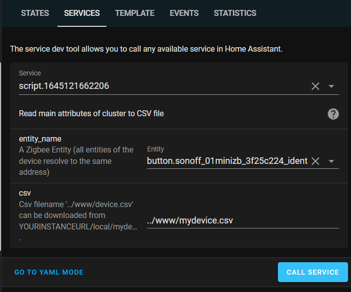
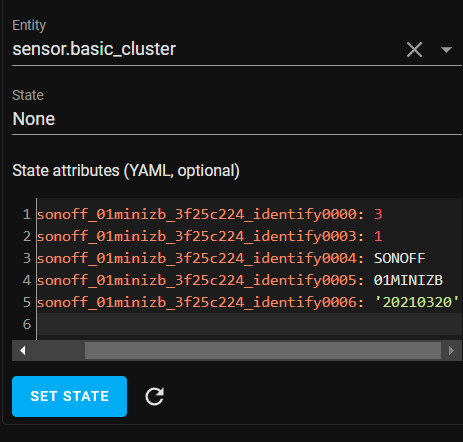

## Read Attributes from Basic Cluster to CSV and state

- `script_read_basic_cluster.yaml`:\
  Script to add to HA (Configuration >
  Scripts):
- `service_call_read_basic_cluster.yaml`:\
  Example of service
  call.\
  
- Values in state:\
  
- Values in CSV:

```csv
2022-02-17T18:27:35.646226+00:00,Basic,zcl_version,3,0x0000,0x0000,1,60:a4:23:ff:fe:91:fc:9a,
2022-02-17T18:27:35.797180+00:00,Basic,app_version,80,0x0001,0x0000,1,60:a4:23:ff:fe:91:fc:9a,
2022-02-17T18:27:35.934612+00:00,Basic,stack_version,0,0x0002,0x0000,1,60:a4:23:ff:fe:91:fc:9a,
2022-02-17T18:27:36.071951+00:00,Basic,hw_version,1,0x0003,0x0000,1,60:a4:23:ff:fe:91:fc:9a,
2022-02-17T18:27:36.212760+00:00,Basic,manufacturer,_TZ3000_dbou1ap4,0x0004,0x0000,1,60:a4:23:ff:fe:91:fc:9a,
2022-02-17T18:27:36.352902+00:00,Basic,model,TS0505A,0x0005,0x0000,1,60:a4:23:ff:fe:91:fc:9a,
2022-02-17T18:27:36.488601+00:00,Basic,date_code,,0x0006,0x0000,1,60:a4:23:ff:fe:91:fc:9a,
```

## Download firmware from different sources.

See `fetchOTAfw.sh` for instructions. The download functionality is now
integrated in
[ota_notify](https://github.com/mdeweerd/zha-toolkit#ota_notify) which is
more selective. If you choose to use the script, you still need to trigger
the OTA update (which can be done using ota_notify).
